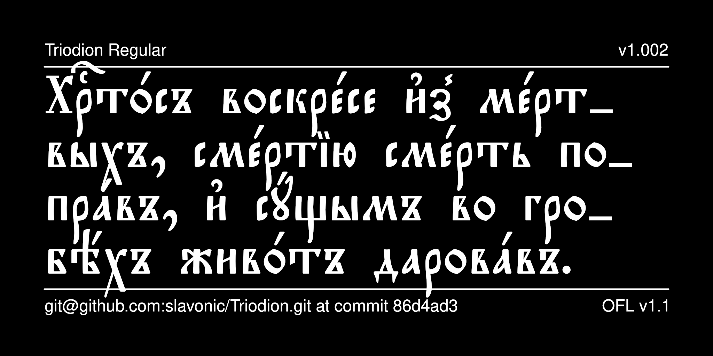

# Triodion Typeface

Triodion is a contemporary Church Slavonic font that reproduces the typeface most commonly used in liturgical books published in
St. Petersburg and Moscow at the end of the 19th and beginning of
the 20th century and the current editions printed in Moscow
by the Publishing House of the Moscow Patriarchate.



Pochaevsk is a contemporary Church Slavonic font that reproduces the typeface used in editions published by the Holy Dormition Pochaiv Lavra in the late 19th century and, subsequently, in editions published in the 20th century by Holy Trinity Monastery in Jordanville, New York.

Due to its small vertical metrics, this font is convenient
for use in bilingual editions featuring Church Slavonic text
and text in another language.


## History

As far as is known, Triodion was created for the 
[Irmologion project](http://irmologion.ru/fonts.html#triodion) by
Vlad Dorosh as Triodion Ucs (version 1, 2003) and was then
released under the LaTeX Project Public License as part of
[CSLTeX](https://sites.google.com/site/csltex/). Reencoded for Unicode
by Aleksandr Andreev as part of the
[Slavonic Computing Initiative](https://sci.ponomar.net/fonts.html)
and edited, released under SIL OFL v. 1.1.
Edited by Aleksandr Andreev for Google Fonts.

## License

This Font Software is licensed under the SIL Open Font License,
Version 1.1. This license is available with a FAQ at
[https://openfontlicense.org/](https://openfontlicense.org/).

## Building the Fonts

The font is built using fontmake and gftools post processing script. Tools are all python based, so it must be previously installed.

To install all the Python tools into a virtualenv, do the following:

From terminal:

```

cd your/local/project/directory

#once in the project folder create a virtual environment. 
This step has to be done just once, the first time:

python3 -m venv venv

#activate the virtual environment

source venv/bin/activate

#install the required dependencies

pip install -r requirements.txt

```

Then run the this command:

```
cd sources
gftools builder config.yaml
```

The fonts are supposed to build automatically in the repository 
using GitHub Actions, but this does not work correctly, 
presumably because of bugs on Google's part.

## Features

* Stylistic Set 1 (*ss01*) changes the hyphen symbol (-) to an 
underscore (_), which is the default hyphenation symbol used
in Synodal Church Slavonic. This can be used for software such
as LibreOffice that does not support changing the default
hyphenation character.

* Stylistic Alternatives (*salt*) are provided for the following
characters:
  - a short version of lowercase yat (U+0463)
  - an alternative form of capital omega (U+0460)
  - seven alternative forms of the Symbol for Mark's Chapter (U+1F545)

See your software's documentation about how to access these glyphs.

## More Church Slavonic Fonts

See the [main repository](https://github.com/typiconman/fonts-cu/issues) and the [website](https://sci.ponomar.net/fonts.html).
